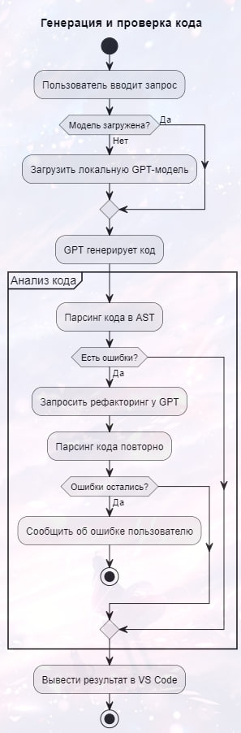
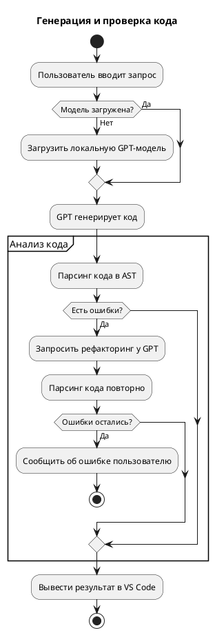
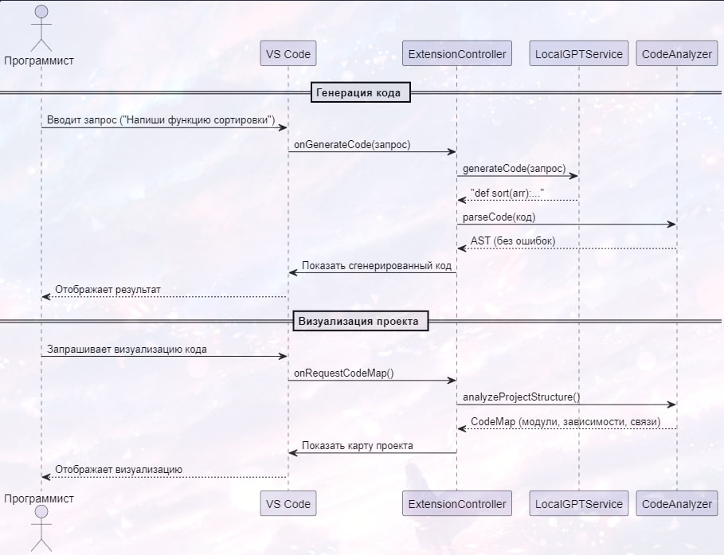
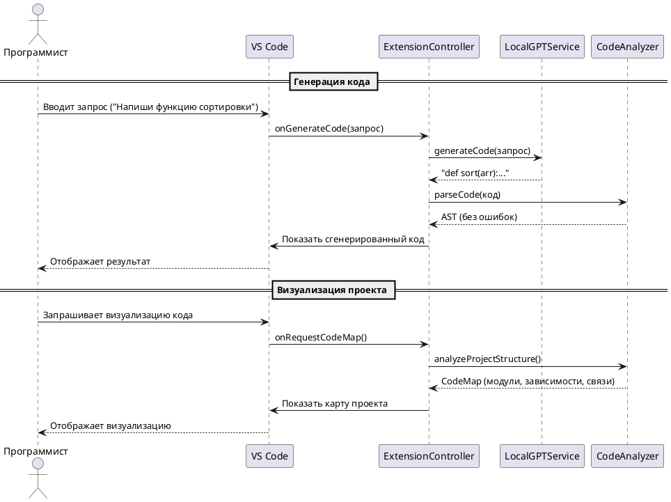
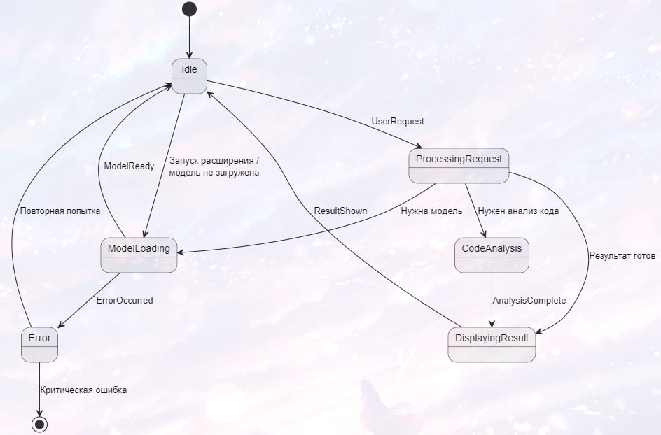
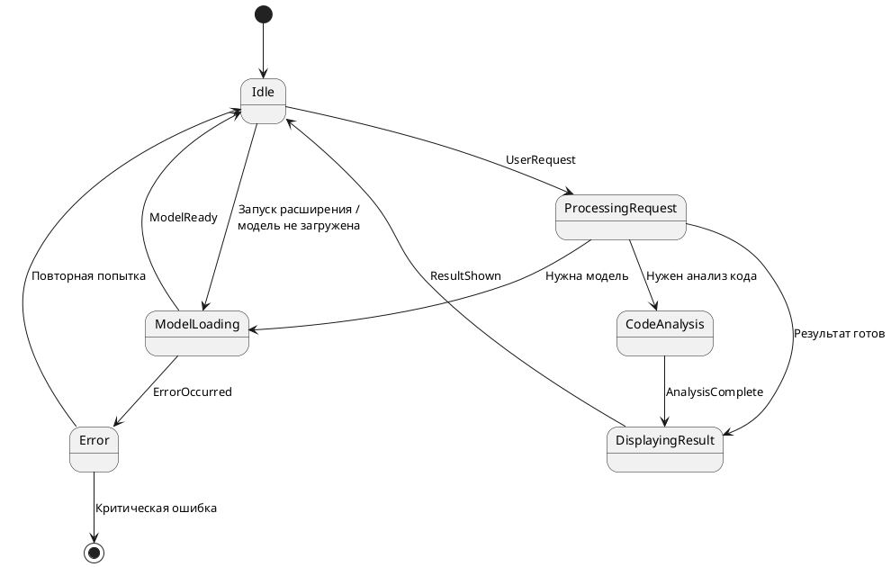
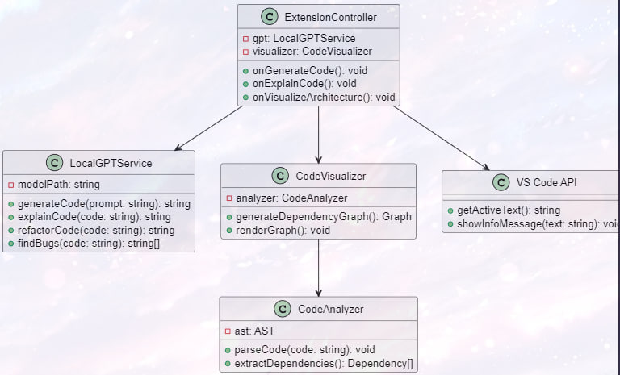
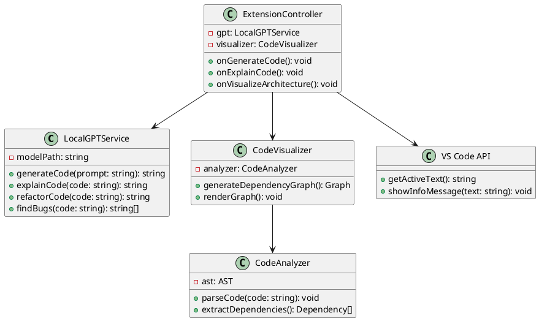
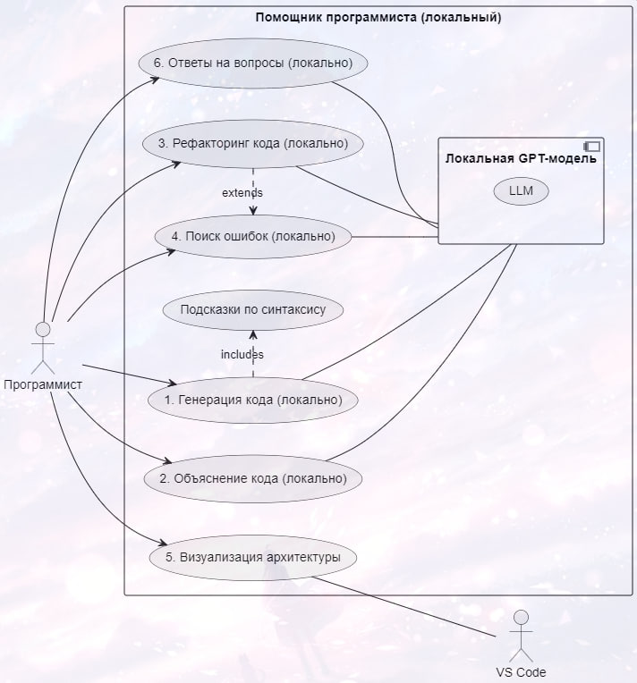
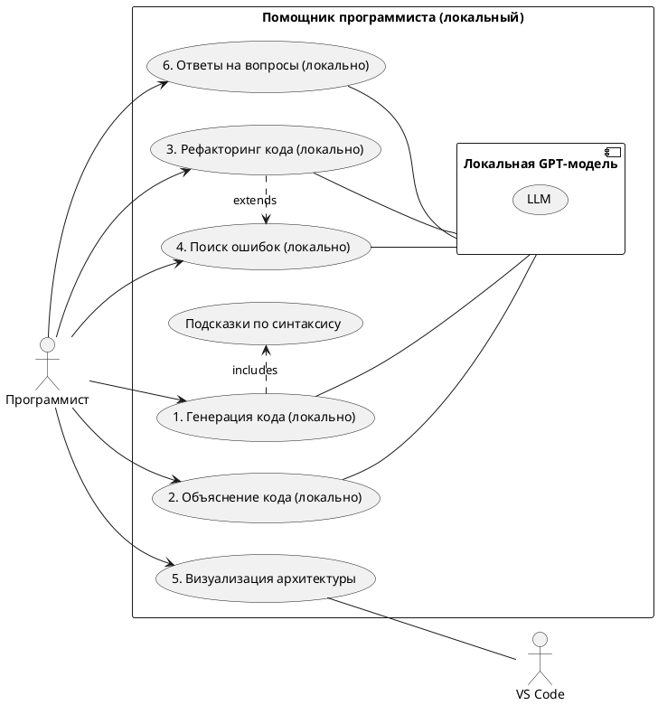

 Расширение для VS Code

## 📷 Диаграммы проекта

### 📌 Диаграмма активностей (Activity Diagram)

> Отражает логику обработки пользовательского запроса, генерации кода и последующего анализа.

---

### 📌 Диаграмма последовательности (Sequence Diagram)

> Показывает взаимодействие между компонентами расширения при генерации кода.

---

### 📌 Диаграмма состояний (State Diagram)

> Иллюстрирует переходы между состояниями расширения: ожидание, загрузка, обработка запроса, вывод результата и ошибки.

---

### 📌 Диаграмма классов (Class Diagram)

> Структура основных компонентов расширения и их связи.

---

### 📌 Диаграмма вариантов использования (Use Case Diagram)

> Общий обзор взаимодействия пользователя с расширением.

---

